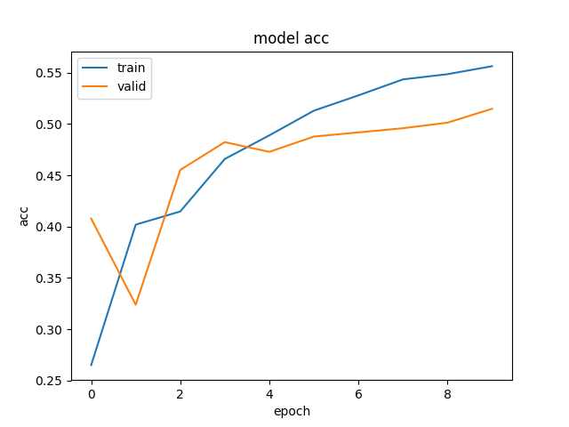
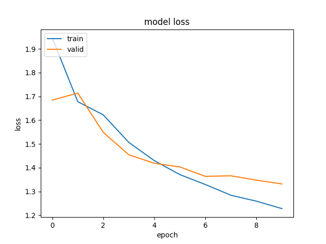

| File                 | Content                                  |
| -------------------- | ---------------------------------------- |
| history_all          | training info (including loss, acc, ..); type = dict |
| history_loss         | training loss                            |
| history_val          | validation loss                          |
| accuracy.png         | plot for training/validation accuracy (10 folds) |
| loss.png             | plot for training/validation loss (10 folds) |
| model_output_allTest | prediction (np.array)                    |
| inter_output_allTest | intermediate output (before FC layers); vector |
| lstm_model.h5        | saved LSTM model                         |
| submission_raw.csv   | not modify known labels from stage 1 test data |
| submission.csv       | modify labels from stage 1 test data     |

