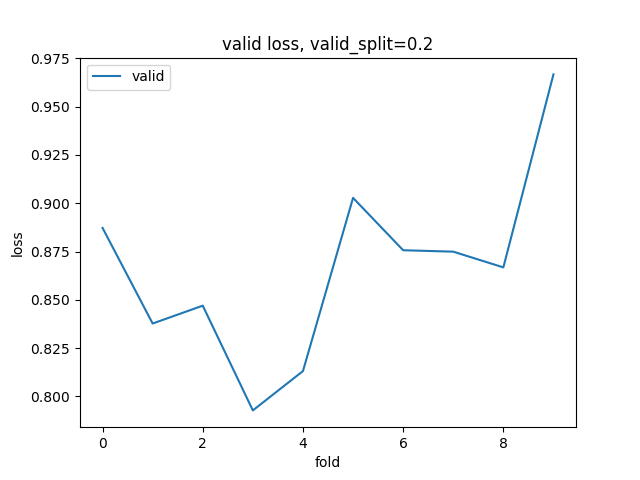

| File           | Content                                  |
| -------------- | ---------------------------------------- |
| submission.csv | kaggle submission                        |
| validLoss      | loss for validation data; test_split = 0.2; pickle file |

